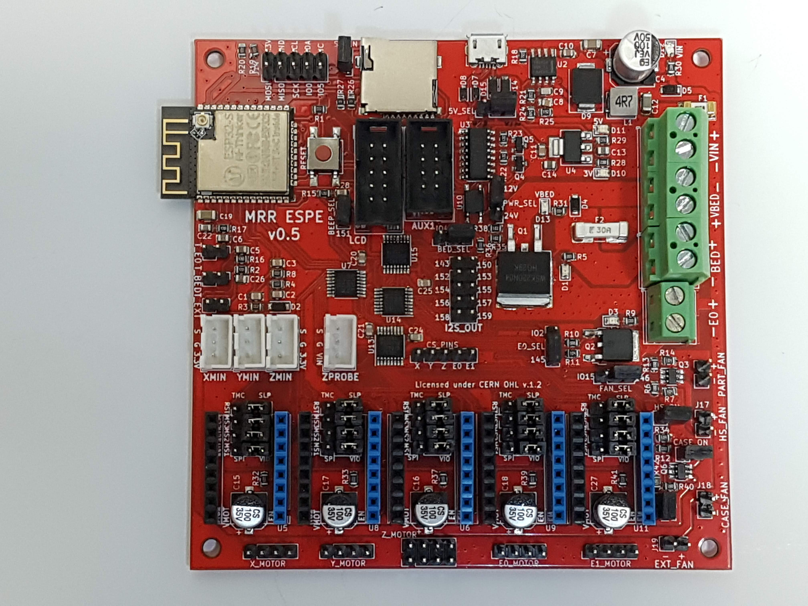

# MRR_ESPE
## A 3D printer control board based on ESP32

This is a 3D printer control board based on the ESP32 microcontroller, which comes with built-in WiFi and BlueTooth.

**Current version: v0.5** 

 

Features:
- Able to use up to 5 stepper drivers: X, Y, Z, E0, and E1.
- 12V to 24V input power supply.
- Separate power supply for the heat bed.
- X, Y, and Z min endstops.
- Allows the use of a Z-axis probe, such as an inductive sensor, running on the input supply voltage (12V to 24V).
- Physical size of 102mm by 102mm. Mounting holes are 3.5mm in diameter, with centers 4mm from the edges.
- "RESET" button can be used to reset the board.
- Use of jumper pins for TMC stepper driver connections.
- Firmware controlled fans: case, E0, and EXT. These fans can be controlled by firmware, or they can be in the "always on" mode by shorting the respective jumpers.
- EXP3 connector for Creality LCD controller. 
- AUX1 connector for use with an external host, such as the closed-source MKS TFT32 (**Untested!!**).

# Firmware

Marlin 2.0 has added support for ESP32, including the use of I2S to drive motor steppers. This board was based on the pins definition file pins_ESP32.h with some modifications based on MRR ESPA.  
In addition, [Luc](https://github.com/luc-github) has been working on a Marlin fork which incorporates part of his ESP3D webUI into Marlin itself. 

**Note: There is a problem with the I2S stepper stream in Marlin firmware; it may result in random pauses during prints** 

## Flashing firmware

- You should be able to flash firmware through the USB port. Depending on your operating system, you may need to install drivers for the CH340. Please use Google or another search engine to find the right CH340 driver for your operating system.
- To flash firmware by directly connecting to TX/RX pins, you will need to connect IO0 to GND, then reboot (press "BOOT" button) to enter flash mode. After flashing the firmware, disconnect IO0 from GND, and press "BOOT" button again to reboot into normal mode.
- Use a baud rate of 115200.

# Jumpers

- 5V_SEL: Connect to VIN for normal operation; only short (close) this jumper to VUSB if you need to power the board via USB. Note: Powering the board with both PSU and USB may cause unstable operation during heating.
- PWR_SEL: Connect the middle pin PWR_SEL to pin labeled "12V" if using 12V; connect PWR_SEL to pin labeled "24V" if using 24V.
- CASE_ON: Leave open for firmware-controlled case fan; short (close) this jumper for case fan to be always on.
- E0_ON: Leave open for firmware-controlled E0 hotend fan; short (close) this jumper for E0 hotend fan to be always on.
- E1_ON: Leave open for firmware-controlled E1 hotend fan (if used); short (close) this jumper for E1 hotend fan to be always on.
- Stepper driver jumpers:
  - MS1: VIO to set high; SPI if using TMC SPI mode
  - MS2: VIO to set high; SPI if using TMC SPI mode
  - MS3: VIO to set high; SPI if using TMC SPI mode
  - RST: SLP if using A4988/DRV8825; SPI if using TMC SPI mode
  - Note: Due to a lack of input pins on the ESP32, UART mode is not supported.

# Pins

See separate PIN_DEF.txt file.

# License
Released under CERN Open Hardware Licence v1.2. See LICENSE.txt for details.

## Warning

- This product uses high currents which may cause fires. Use with caution.
- Do not use input voltages higher than 24V. Input current must not exceed 15A.
- Do not attempt to use more than 15A for the heated bed. While the MOSFET is capable of such currents, the connectors are not. If you need more than 15A, use an external MOSFET. In any case, it is highly recommended to use an external MOSFET for the heated bed to avoid drawing high currents through this product.
- If using a current of more than 10A for the heated bed, it is highly recommended to provide active cooling for the board as the MOSFET and adjacent areas can get very hot due to the high current.
- The underside of the board has PCB traces which are exposed for better cooling. These traces may be carrying high currents and can get very hot. DO NOT touch them, and DO NOT allow these traces to come into contact with metal or other conductive materials.
- Do not attempt to use more than 5A for the hot end. While the MOSFET is capable of such currents, the connectors are not. If you need more than 5A, use an external MOSFET.
- The fan outputs can safely drive up to 0.25A, which is more than enough for most cooling fans. Active cooling of the MOSFETs is recommended for driving currents up to 1A; without active cooling, the MOSFETs can get unduly hot when driving more than 0.25A.
- Do not reverse polarity.
- The breakout and endstop pins are rated for 3.3V, which is the voltage the ESP32 operates at. Attempting to feed inputs above 3.3V to these pins may damage the board.
- It is recommended to power the board only via USB (i.e. turn off PSU power supply) when flashing the board.
- This is still a work in progress. It is recommended not to attempt production using this schematic, although it has been extensively tested.

## Disclaimer

This product is provided as-is. While care has been taken to design a safe product, it is the user's responsibility to make sure precautions are taken to prevent damage or injury when using this product. This includes adhering to all warnings provided. By using this product, the user accepts responsibility to bear all liabilities from any damage or injury arising from the use of this product.
